# Weather360

This is a weather app which addresses the need for a fast and easy to manage article system,
while providing a focus on weather and climate information.

- It uses the following Azure Services: **Azure Virtual Machine**, **Azure Text-To-Speech**.
- The backend is coded using Java Servlet, Tomcat Server, JDBC db connection, MySQL database, JSP for frontend.

# Setup on Azure

1. Create a Linux VM for running the application backend and storing the MySQL database.

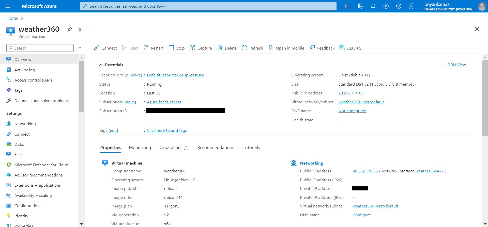

2. Create an API key for accessing the Azure Speech Services.

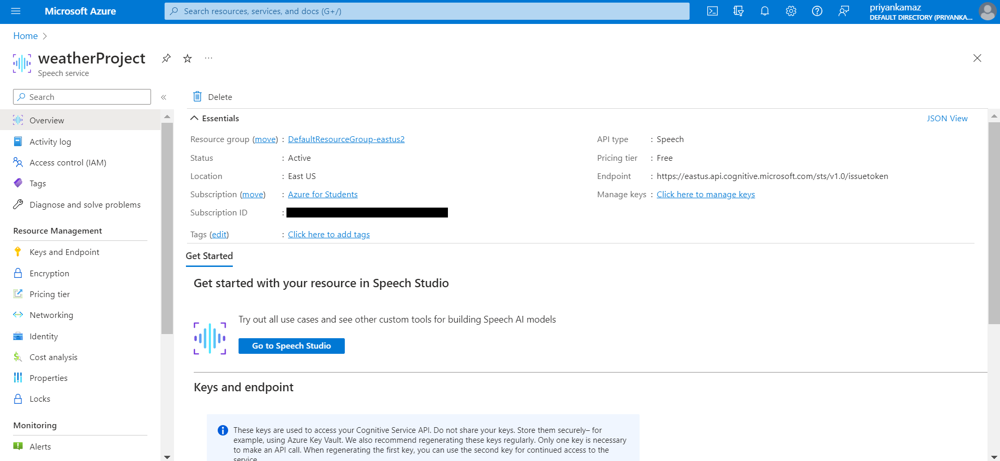

Navigate to [article.jsp](https://github.com/priyanka-maz/Weather360/blob/4fda46c91d92217ffbfe3aaaadb6a9d3a1427b8c/Weather%20News/src/main/webapp/article.jsp#L81C8-L110C12) and paste in your Azure Speech Services Key in the following code block:
```js
        try {
            fetch("https://eastus.tts.speech.microsoft.com/cognitiveservices/v1", {
              method: "POST",
              headers: {
                "Ocp-Apim-Subscription-Key": "",
                "Content-Type": "application/ssml+xml",
                "X-Microsoft-OutputFormat": "audio-16khz-128kbitrate-mono-mp3",
              },
              body: `<speak version='1.0' xml:lang='en-US'>
                     <voice xml:lang='en-US' xml:gender='Female' name='en-US-JennyNeural'>
                         ${textContent}
                     </voice>
                 </speak>`,
            })
              .then((response) => response.arrayBuffer())
              .then((arrayBuffer) => {
                var blob = new Blob([arrayBuffer], { type: 'audio/mp3' });
                var url = URL.createObjectURL(blob);
                var audio = new Audio();
                audio.src = url;
                audio.play();
              })
              .catch((error) => {
                console.error("Error:", error);
                alert("Oops! An error occurred.");
              });
          } catch (error) {
            console.error("Error:", error);
            alert("Oops! An error occurred.");
          }
```

Note: API keys used for the deployment of the demo have been removed from this git repo for security reasons.

# Setup Java Project

* Clone the repo
   ```sh
   git clone https://github.com/priyanka-maz/Weather360
   ```

* Make sure MySQL is installed. We assume user:'root', password:'abcd'.

* Make sure Apache Tomcat 9.0.x is installed.

## Using Eclipse

1. Import project into Eclipse.

2. Setup tomcat server on any available port (say, 8080).

## Using jre directly (such as on a Linux VM on Azure)

1. Export WAR file from Eclipse.

2. Install tomcat-9.0.x server following instructions given at https://www.digitalocean.com/community/tutorial_collections/how-to-install-apache-tomcat

3. Navigate to tomcat manager and upload and deploy WAR file.

Note: Navigate to /Startup to have the application automatically create the database and tables for you.

## Screenshots

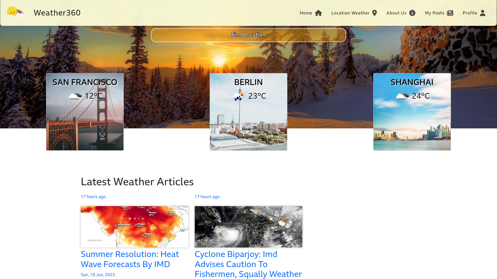
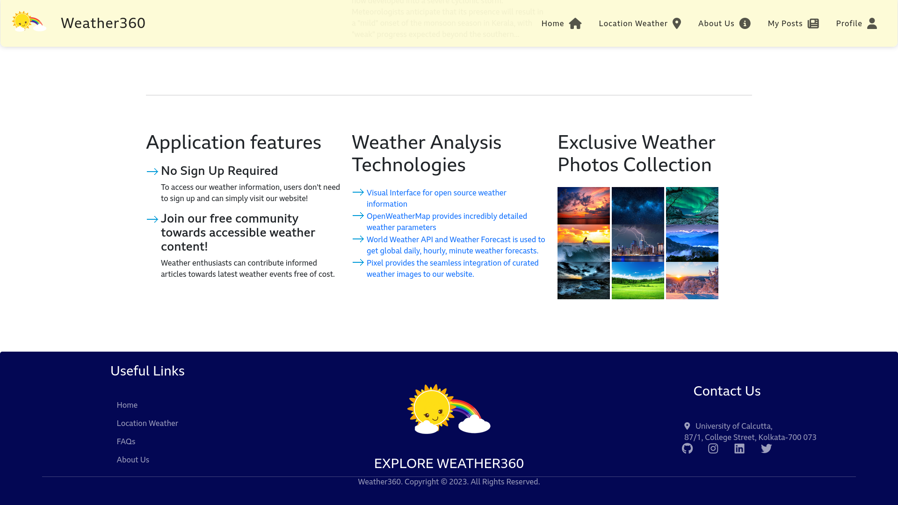
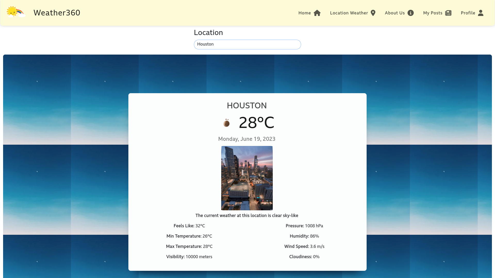
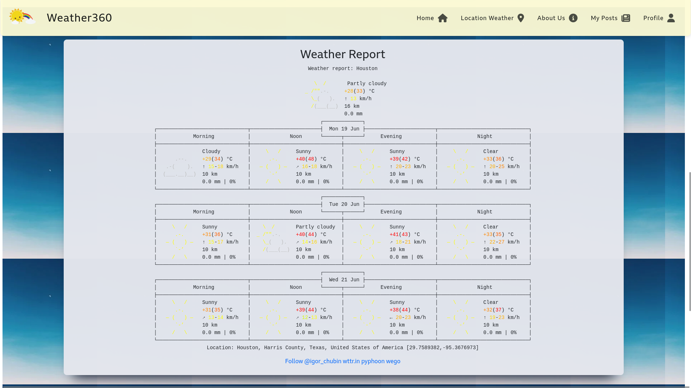
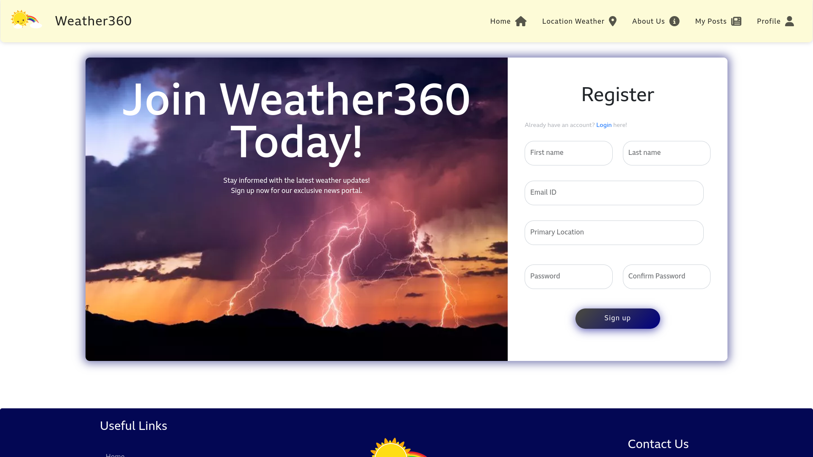
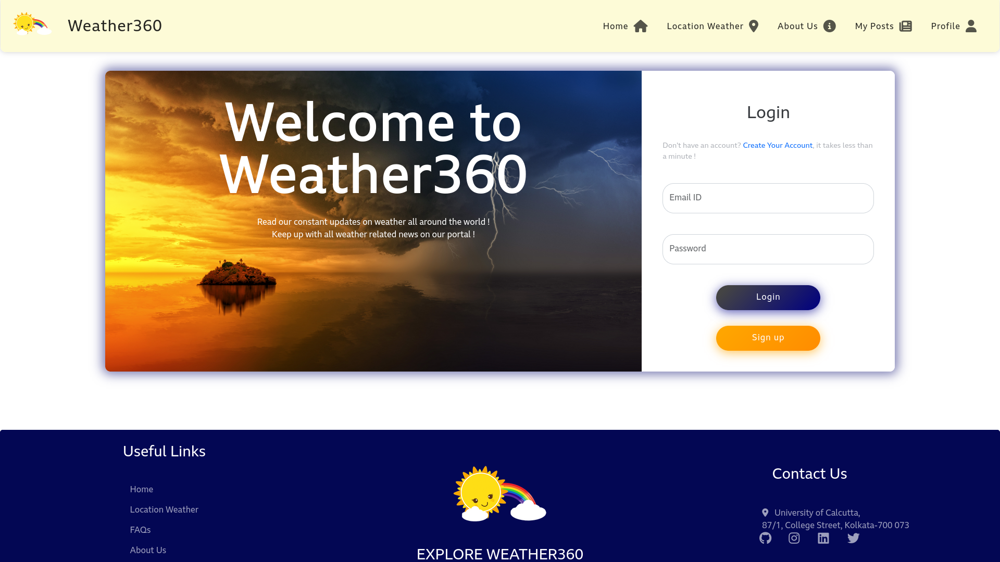
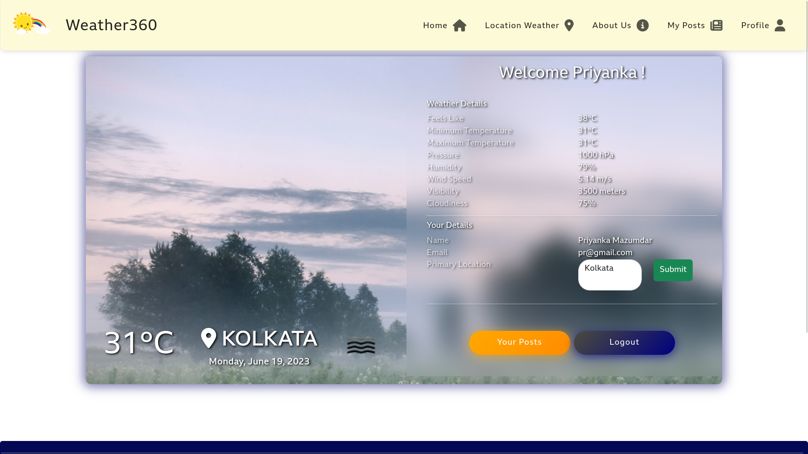
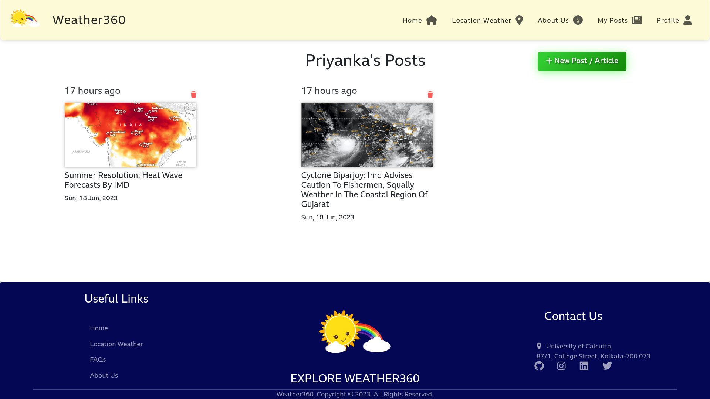
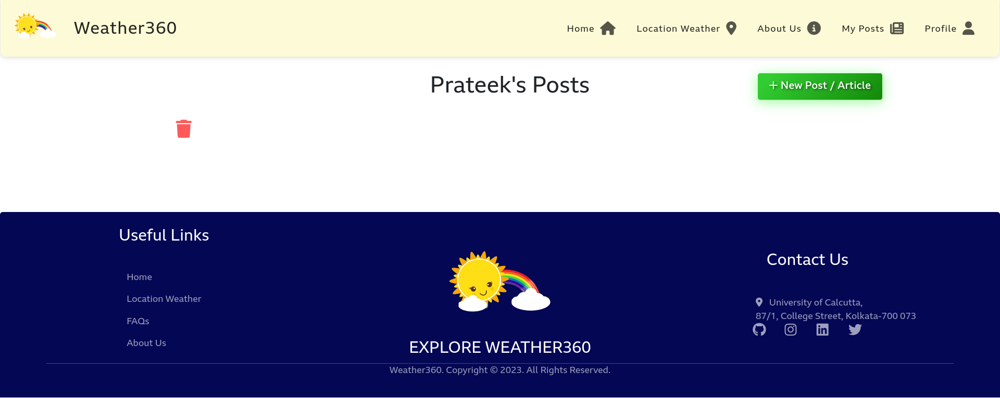
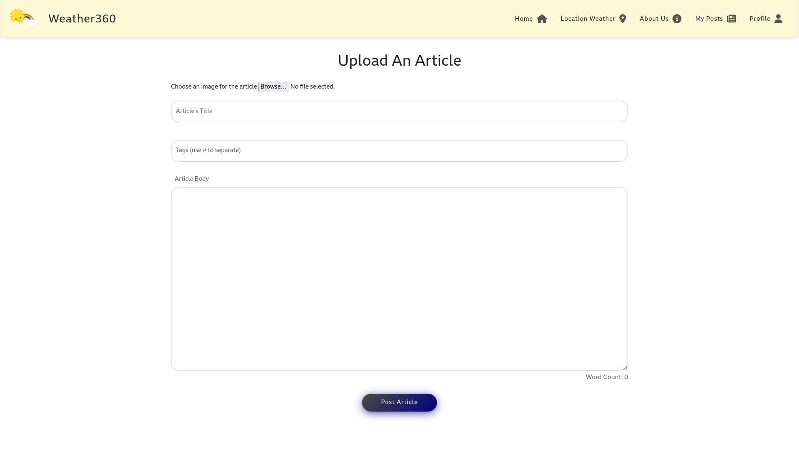
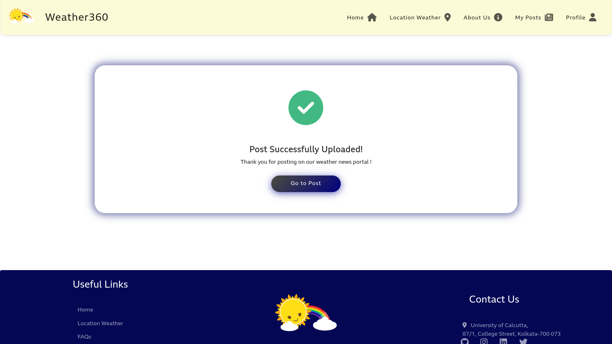
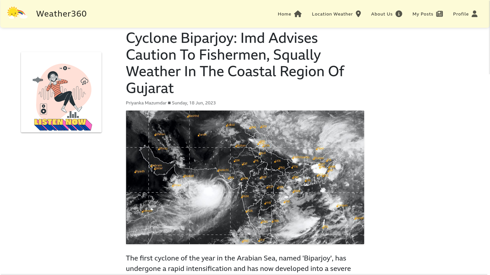
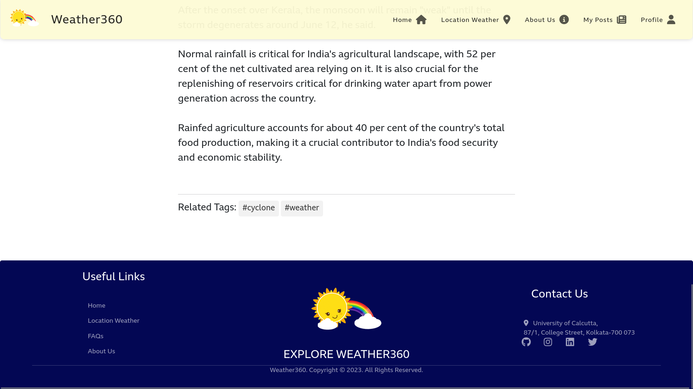
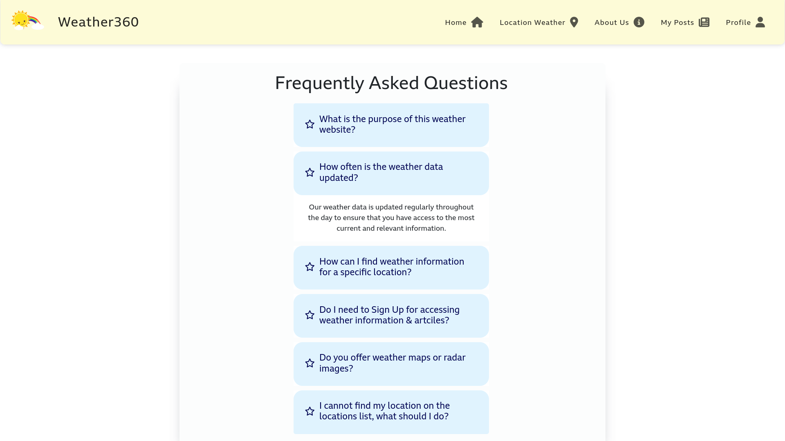
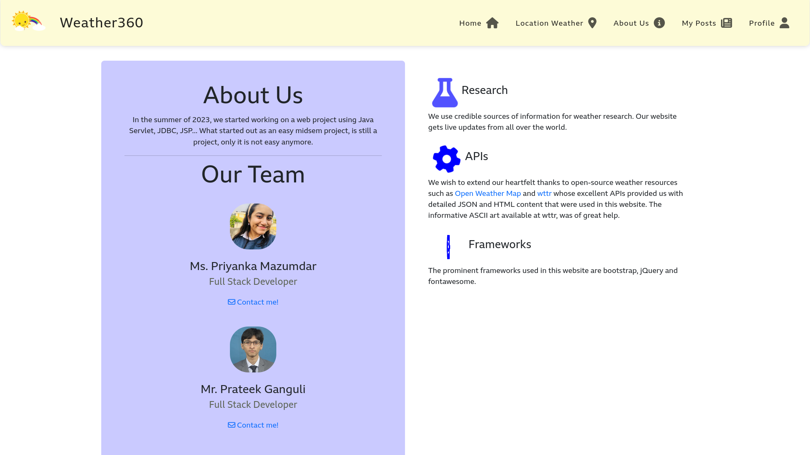
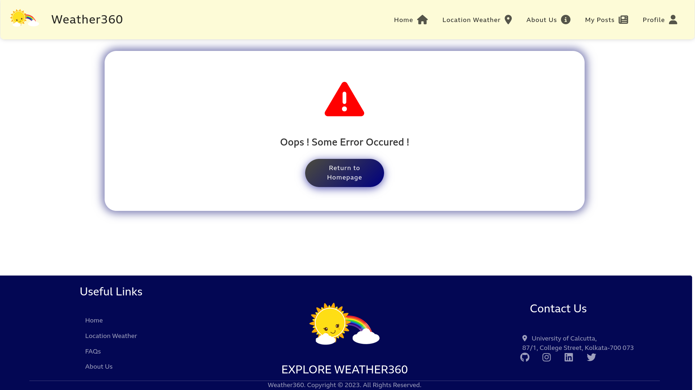

## Features

- User Registration and Session Cookie based authentication for login.
- Passwords are stored using Bcrypt Hashing Algorithm.
- Users may logout.
- Users may specify their default location for displaying of weather news.
- Users may post articles with images and tags.
- Users may delete their own posts.
- Latest 6 posts can be viewed from the front page; others may be navigated using the posts link.
- Users can view wether information for any location of their choice.
- Users can listen to a TTS version of posts using Azure's Speech Service.

## File Structure

```
.
├── LICENSE .................................................... License terms
├── README.md .................................................. This document
└── Weather News
    ├── build
    │   └── classes
    │       └── pkg ............................................ Compiled Java classes
    └── src
        └── main
            ├── java
            │   └── pkg ........................................ Java Servlet sources
            └── webapp ......................................... HTML and JSP templates
                ├── META-INF
                │   └── MANIFEST.MF ............................ JAR manifest
                ├── other
                │   ├── css .................................... Font and CSS rules
                │   └── js ..................................... JS files
                ├── Pics ....................................... Static and Uploaded images
                └── WEB-INF
                    ├── lib
                    │   └── mysql-connector-java-8.0.30.jar .... MySQL connector JAR
                    └── web.xml ................................ Listing of servlet welcome files
```
